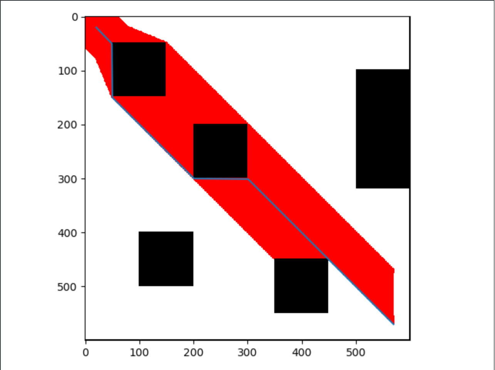
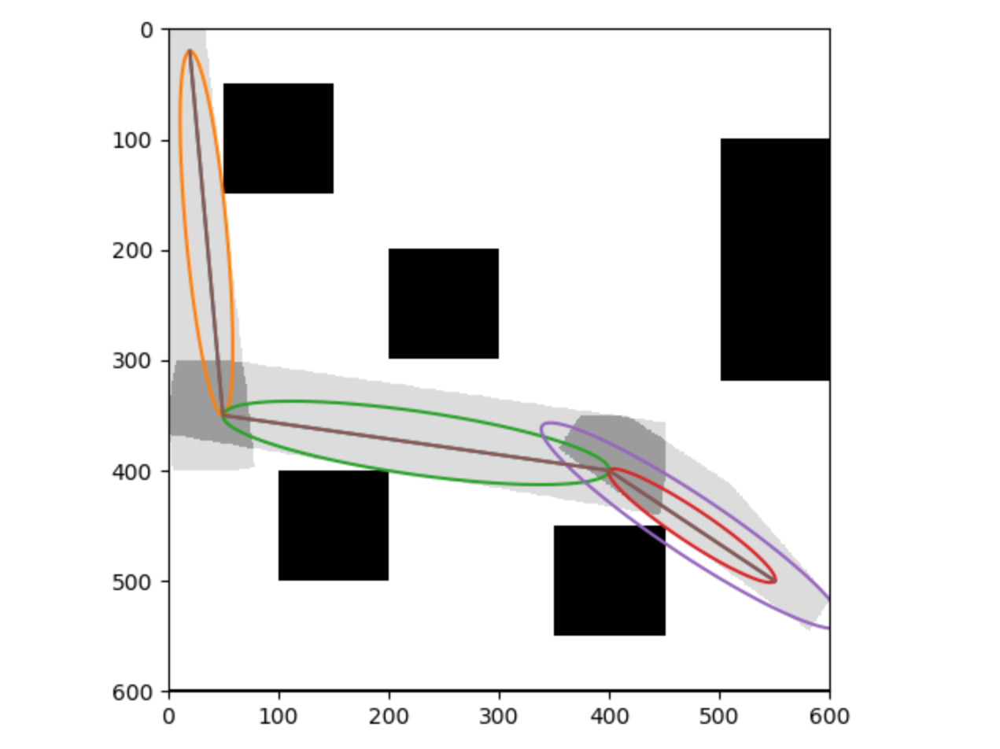

# python path smooth

### A star for a simple path:

Use `A*` algorithm to find a possible path.

Sample result:

Just run the `a_star/two_d_mat_test.py` to obtain the result.

### Safety area finding using ellipse:

Use method of ballooning ellipse and find tangent lines to find safe operating area.

Sample result:

